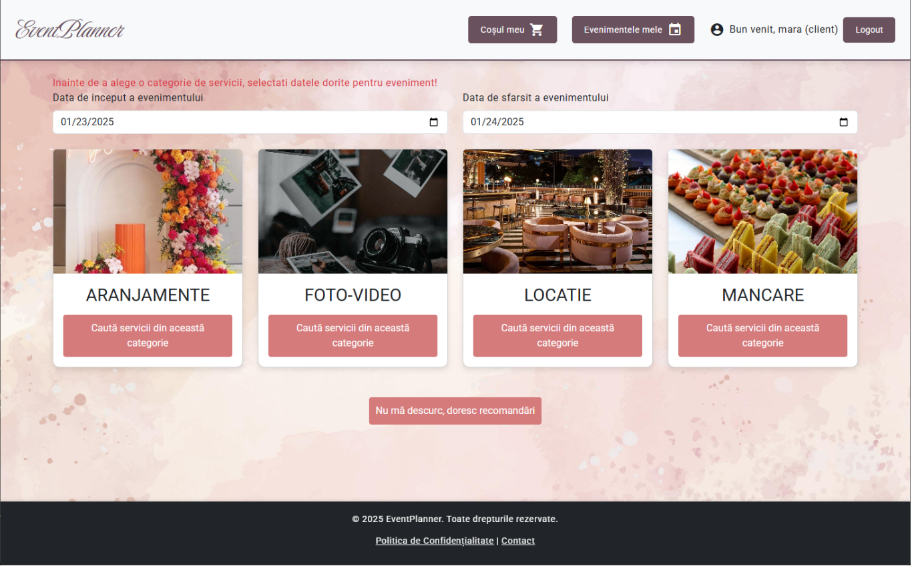
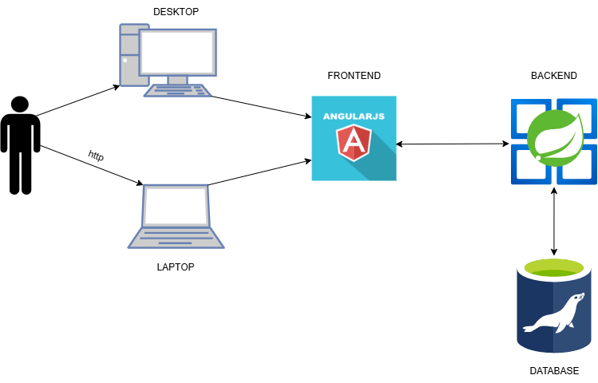
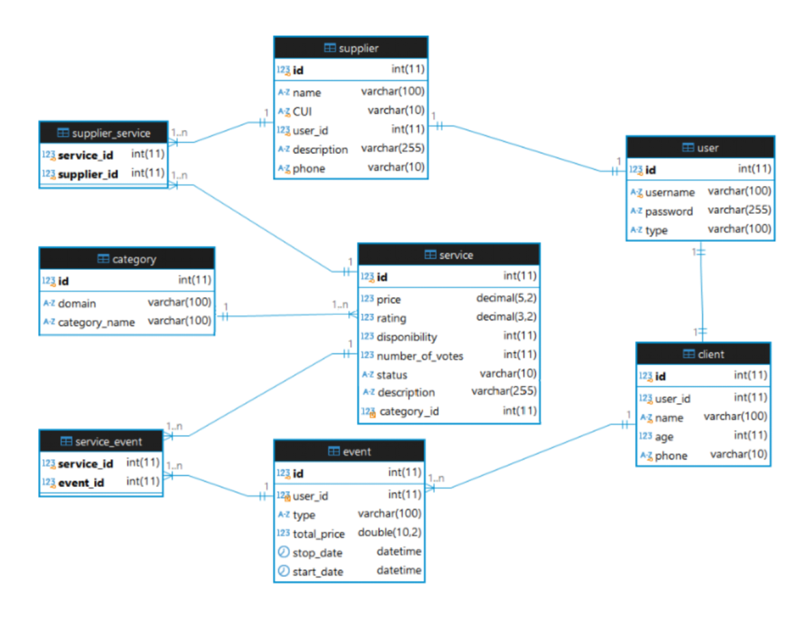
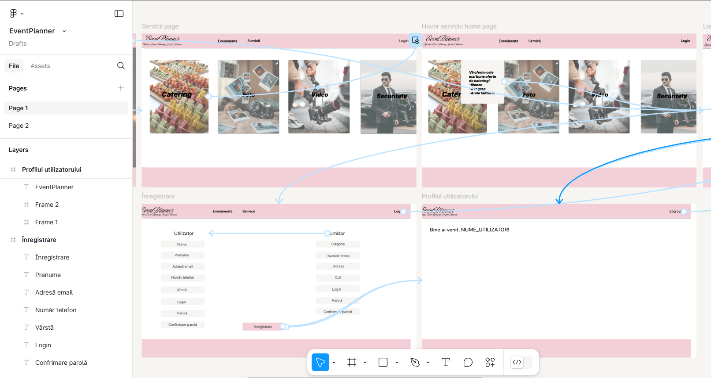
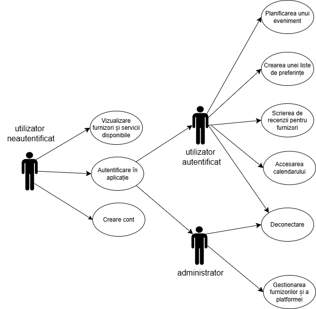

# EventPlanner

A comprehensive event planning and budget management platform that simplifies the organization of events by connecting clients with service providers.

## Overview

EventPlanner is a full-stack web and desktop application designed to streamline event organization. The platform allows users to discover, compare, and book various services (catering, photography, venues, decorations, etc.) while managing their event budgets efficiently.

## Team

This project was developed by a team of four:
- **Apetroaei Cezar-Ștefan**
- **Barila Sabina Nadejda**
- **Goriuc Antonia**
- **Marcu Alexia**

## Features

### For Clients
- Browse and filter service providers by domain, price, and reviews
- Create and manage events with budget tracking
- Save preferred services to wishlists
- Leave reviews and ratings for service providers
- Generate detailed expense reports

### For Service Providers
- Register and showcase services on the platform
- Manage service availability and pricing
- Receive client feedback and ratings

### For Administrators
- Approve or reject provider services
- Manage users and platform content

## Tech Stack

### Frontend
- **Angular** - Web application framework
- **Electron** - Desktop application framework
- **Bootstrap** - CSS framework for responsive design

### Backend
- **Spring Boot** - Java-based backend framework
- **MariaDB** - Relational database management system

## Architecture

The system follows a client-server architecture with:
- Web application for clients to browse and book services
- Desktop application for service providers to manage their offerings
- RESTful API backend handling business logic
- Centralized database storing users, services, events, and bookings

## Database Schema

## User Interface Design

## Use Cases

## User Roles

1. **Client** - Can search services, create events, manage budgets
2. **Supplier** - Can add and manage services, view bookings
3. **Administrator** - Can approve services, manage platform

## Project Status

✅ Completed - Architecture and requirements documentation finalized